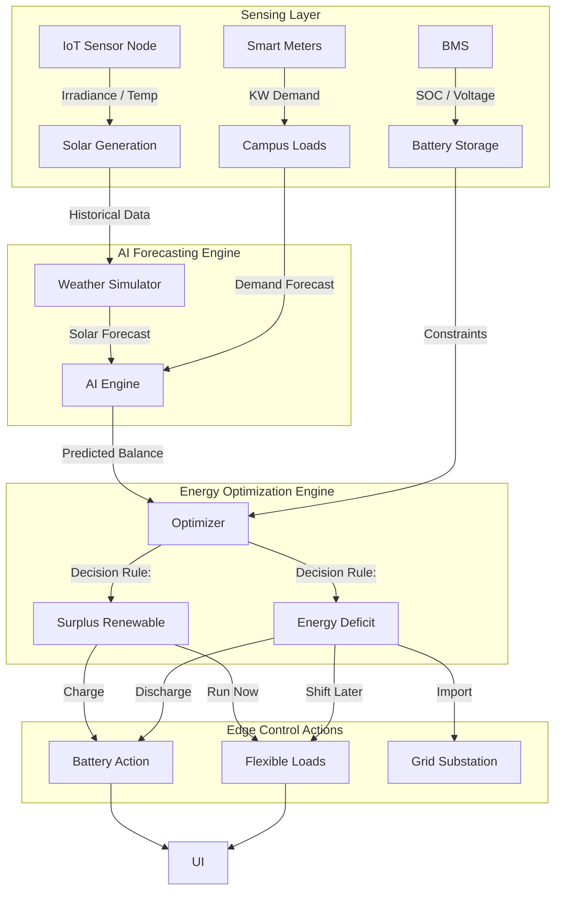
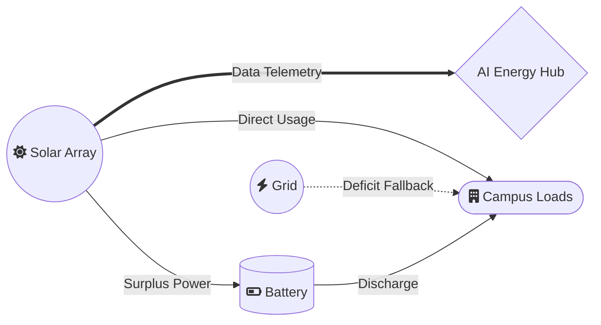

# ⚡ Campus AI Energy Manager – 3D Digital Twin


An advanced, interactive 3D digital twin of a smart university microgrid built for the Smart India Hackathon. It visualizes and simulates solar generation, battery energy storage systems (BESS), flexible campus loads, AI forecasting, and dynamic energy optimization in real-time right inside the browser.

---

## 🎯 Features

This prototype is built out across 7 major architectural layers:

- 🏗️ **Interactive 3D Campus:** A fully navigable 60x45 3D campus base featuring functional academic buildings, hostels, grid substations, and an EV charging zone.
- ☀️ **Solar Array Simulation:** A detailed 4-panel solar array with IoT sensor telemetry generating live irradiance, voltage, and power output based on diurnal weather curves.
- 🧠 **AI Energy Hub:** The "brain" of the campus, featuring physical edge controllers (Raspberry Pi/ESP32), interactive HMI display screens, and IoT data-flow visualizations.
- 🔋 **Smart BESS (Battery Energy Storage System):** Explodable 3D battery racks with an integrated Battery Management System (BMS) simulating state-of-charge (SOC) limits and charge/discharge flow.
- 🔌 **Flexible Load Management:** Individual smart appliances (EV Chargers, Smart ACs, Water Pumps) that can be individually shed, shifted, or run based on renewable availability.
- 🔮 **AI Forecasting Engine:** A 24-hour look-ahead predictive engine displaying a dual-line chart for expected Solar Generation vs. Campus Demand across varying weather scenarios.
- ⚖️ **Energy Optimization Engine:** A deterministic rule-based engine that autonomously decides whether to charge the battery, shed flexible loads, or import from the grid, generating explainable AI plans (e.g., *"Solar generation exceeds demand. Excess energy is directed to battery storage..."*).

---

## 🏗️ System Architecture

The digital twin models physical hardware, telemetry logic, and AI decision-making algorithms cleanly separated into modules.



---

## ⚡ Energy Flow Simulation

Energy routing is visualized dynamically via glowing volumetric particle systems routing across the 3D campus. The `EnergyOptimizationEngine` routes these streams in real-time.



---

## 💻 Tech Stack

- **Graphics:** [Three.js](https://threejs.org/) (WebGL rendering, Raycasting, Animations, Particles)
- **UI & Overlays:** CSS2DRenderer & HTML5 Canvas texturing for in-world screens
- **Bundler:** [Vite](https://vitejs.dev/)
- **Styling:** Pure CSS (CSS variables, Flexbox)

---

## 🚀 Quick Start (Local Development)

To run the digital twin locally on your machine:

1. **Clone the repository:**
   ```bash
   git clone https://github.com/YOUR_USERNAME/campus-ai-energy-manager.git
   cd campus-ai-energy-manager
   ```

2. **Install dependencies:**
   ```bash
   npm install
   ```
   *(Ensure you have Node.js 18+ installed)*

3. **Start the development server:**
   ```bash
   npm run dev
   ```

4. **View in browser:**
   Open `http://localhost:5173` in any modern web browser.

---

## 🌐 Deploying to Vercel

Because this is a standard Vite app, it can be deployed to Vercel in less than a minute.

1. Go to [Vercel](https://vercel.com/new).
2. Import your GitHub repository.
3. Vercel will auto-detect Vite. The default build settings (`npm run build`, output dir: `dist`) are already correct.
4. Click **Deploy**.

---

## 🎮 How to Use the Digital Twin

Once loaded, you can interact with the environment:
- **Left Click + Drag:** Rotate camera orbit.
- **Right Click + Drag:** Pan camera.
- **Scroll Wheel:** Zoom in/out.
- **Click on the Solar Panels:** Opens live IoT telemetry and solar simulation controls (toggle weather scenarios).
- **Click on the Smart Battery:** Expands the internal modules and opens BMS logic.
- **Click on the AI Energy Hub:** Opens the primary dashboard. Click **"VIEW AI FORECAST"** to see dual-line charts predicting energy, or click **"OPTIMIZATION PLAN"** to see the system's real-time deterministic decision logs.
- **Click on the Hostels/Academic Building:** Allows you to override specific appliances (like EV Chargers or Pumps) and watch the optimization engine recalculate the energy flow constraints.

---
*Built for the Smart India Hackathon (SIH)*
